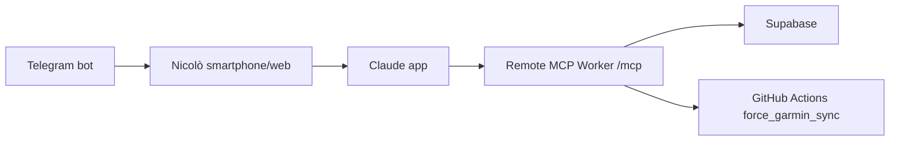

# Claude Mobile Coach

Obiettivo: usare Claude web/mobile come interfaccia coach principale sfruttando l'abbonamento Claude, senza chiamate LLM API backend per weekly review e race briefing.

## Architettura



## Setup Claude

1. Apri Claude web/desktop.
2. Vai in Settings → Connectors.
3. Aggiungi il connector remoto del Worker `mcp-server`.
4. URL: `https://<worker-domain>/mcp`.
5. Header auth: `Authorization: Bearer <MCP_BEARER_TOKEN>`.
6. Verifica da Claude mobile: `dammi il piano dei prossimi 7 giorni`.

## Prompt consigliati

```text
Fai la weekly review. Usa get_weekly_context, forza Garmin sync se serve, poi proponi la prossima settimana. Non committare finché non dico ok.
```

```text
Analizza l'ultima sessione. Voglio sintesi, confronto col piano e un'azione pratica.
```

```text
Attiva race week protocol per la prossima gara.
```

```text
Dammi il piano dei prossimi 7 giorni.
```

## Tool principali

| Tool | Uso |
| --- | --- |
| `get_weekly_context` | Payload unico per weekly review: sync, metriche, wellness, attività, piano, log, analisi. |
| `get_race_context` | Payload gara: prossima race, forma recente, piano fino alla gara, log soggettivi. |
| `get_session_review_context` | Analisi selettiva di una sessione, senza automazione post-ingest. |
| `get_upcoming_plan` | Lettura rapida del piano futuro. |
| `force_garmin_sync` | Aggiorna Garmin prima della review se i dati sono vecchi. |
| `commit_plan_change` | Scrive su DB solo dopo conferma esplicita. |

## Regole operative

- Claude propone e spiega; Nicolò decide.
- Nessuna modifica a `planned_sessions` senza conferma esplicita.
- Brief mattutino, debrief, proactive questions e notifiche restano Telegram/rule-based.
- Weekly review, race briefing e session analysis on-demand usano Claude app/subscription, non API backend.
